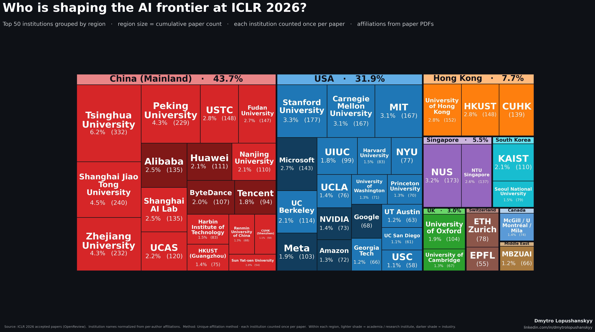

# ICLR 2026 — Institutional Affiliations Dataset & Analysis

End-to-end pipeline that turns 5,356 [ICLR 2026](https://openreview.net/group?id=ICLR.cc/2026) accepted papers into a clean, **PDF-derived** institutional-affiliation dataset and a publication-ready treemap of who is shaping AI research right now.

This avoids the OpenReview-profile drift problem (where authors' *current* job appears on every paper they ever wrote — e.g. listing Wyoming as the affiliation for a paper actually written at UBC). Affiliations come from the **paper's title block PDF**, not from author profiles.

> **Follow me for more analysis like this, plus AI engineering & research insights:**
>
> - LinkedIn — **[linkedin.com/in/dmytrolopushanskyy](https://linkedin.com/in/dmytrolopushanskyy)**
> - GitHub — **[github.com/dmytrolopushanskyy](https://github.com/dmytrolopushanskyy)**
>
> If this dataset or the pipeline is useful to your work, a follow / star is the easiest way to encourage me to keep publishing this kind of analysis.

---

## The headline chart



Each rectangle is one institution sized by the number of accepted papers it appears on (counted **once per paper**, regardless of how many of the paper's authors are affiliated with it). Region cells are sized by the cumulative count of their top-50 institutions. Lighter shade = academia / research institute, darker shade = industry.

**Square version** (for social posts):
`charts/iclr2026_top50_treemap_unique_grouped_square.png`

---

## What's in `data/`

| File | What it is |
|---|---|
| `iclr2026_public.csv` / `.xlsx` | **The main dataset.** 5,356 accepted papers with PDF-derived authors and institutions, normalized institution canonical names, country/region, abstract, OpenReview URL. UTF-8 with BOM for Excel compatibility. |
| `iclr2026_institutions_ranked_unique.csv` | Top-N institutions ranked by unique-affiliation count (each institution +1 per paper). |
| `iclr2026_institutions_ranked_first_author.csv` | Same, but only counting the first author's institution. |
| `iclr2026_institutions_ranked_fractional.csv` | Same, with fractional 1/N credit per institution per paper. |
| `iclr2026_method_sensitivity.csv` | Side-by-side rank under all three counting methods, so you can see which institutions are robust and which are method artefacts. |

### Columns in `iclr2026_public.csv`

| Column | Meaning |
|---|---|
| `Decision` | Oral / Poster |
| `Title` | Paper title (LaTeX math markup converted to Unicode — `$\alpha$` → α, `$\nabla$` → ∇, `$\textrm{...}$` → plain text, etc.) |
| `Authors` | Semicolon-separated, in author order |
| `Institutions` | Same row order as `Authors`. PDF-extracted text per author (with OpenReview fallback for the ~6% of papers where PDF parsing failed). |
| `Institutions_canonical` | Normalized via ~250 rules. `MIT` / `Massachusetts Institute of Technology` / `MIT CSAIL` all collapse to **MIT**. Deduped per paper. |
| `Countries` | Per-paper deduped list. |
| `Regions` | High-level region per paper (China, USA, Hong Kong, etc.). |
| `Affiliation_source` | `pdf` (94%) / `parse_fail` (6%) / `no_pdf` (4 papers). Audit trail. |
| `Primary_Area` | OpenReview track. |
| `Keywords` | Author-supplied. |
| `Abstract` | Full text. |
| `OpenReview_URL` | Direct link to the paper. |

---

## Quick start

### Just regenerate the chart

```bash
git clone https://github.com/dmytrolopushanskyy/iclr2026-affiliations.git
cd iclr2026-affiliations
python3 -m venv .venv && source .venv/bin/activate
pip install -r requirements.txt
python3 make_iclr_treemap.py --source pdf
```

This reads `data/iclr2026_public.csv` and writes the treemap PNGs/SVGs into `charts/`.

Add `--shape square` for a 1:1 version. Add `--source openreview` to compare against the OpenReview-profile-only version (requires running the scraper first).

### Reproduce the full pipeline from scratch

You only need this if you want to re-derive the dataset (e.g., for a new conference). It takes ~1–2 hours of network time and ~5 GB of disk for the PDF cache.

```bash
# 1. Scrape OpenReview metadata (requires an account)
export OPENREVIEW_USERNAME=...
export OPENREVIEW_PASSWORD=...
python3 scrape_openreview.py
# → data/iclr2026_accepted.{csv,xlsx}

# 2. Download all accepted-paper PDFs (~5 GB; rate-limited; retry script handles 429s)
python3 download_missing_pdfs.py
python3 retry_missing_pdfs.py     # picks up anything that hit a 429 the first time

# 3. Parse PDFs and merge with OpenReview data
python3 build_pdf_spreadsheet.py
# → data/iclr2026_accepted_pdf.{csv,xlsx} + data/pdf_parse_summary.txt

# 4. Build the public-facing CSV (sanitization + LaTeX-to-Unicode + canonical names)
python3 build_public_spreadsheet.py
# → data/iclr2026_public.{csv,xlsx}

# 5. Render the charts
python3 make_iclr_treemap.py --source pdf
# → charts/iclr2026_top50_treemap_*.{png,svg}
```

---

## How the parser works

`parse_pdf_affiliations.py` handles four layout patterns common in ICLR template papers:

| Pattern | Layout | Example |
|---|---|---|
| **A** | Numbered footnote markers | `Author1,2 Author1,3 ... \n 1Inst A 2Inst B 3Inst C` |
| **B** | No markers, single shared affiliation | `Author1, Author2 \n Single Institution` |
| **C** | Per-author stanzas separated by emails | `Author1 \n Inst A \n a@x.edu \n Author2 \n Inst B \n b@y.edu` |
| **D** | Alternating name / affil pairs (no emails) | Common for industry-only papers (Apple, Anthropic, etc.) |

Plus a footnote-text filter that catches and discards "Equal contribution", "Corresponding author", "Project lead", "These authors contributed equally" — these used to leak into affiliation strings before being filtered out.

Result: **96% of papers parse successfully**; the remaining 4% fall back to OpenReview profile data (transparently flagged in the `Affiliation_source` column).

---

## Methodology choices, briefly

- **Counting**: each institution counted **once per paper**, regardless of how many of its authors are listed. Same rule used by the AI World NeurIPS leaderboard. The repo also generates first-author-only and fractional 1/N variants for sensitivity.
- **Canonicalization**: ~250 regex rules collapse spelling/abbreviation variants (HKUST = Hong Kong University of Science and Technology = The Hong Kong University of Science and Technology, etc.). Institutions in the chart's top-50 are stable across all three counting methods (see `data/iclr2026_method_sensitivity.csv`).
- **Region grouping**: countries → 17 broad regions for the treemap. Hong Kong is shown separately from mainland China because Hong Kong universities operate under a separate higher-education system (different governance, language of instruction, listed separately in QS/THE rankings).

---

## License

[MIT](LICENSE). The data is derived from publicly available [OpenReview](https://openreview.net) submissions and ICLR 2026 paper PDFs; please cite this repository if you use it in published work.

---

## Stay in touch

If you build something on top of this, ping me — I'm always interested in seeing where this kind of pipeline gets used. And if you want more posts like this (research-engineering deep dives, applied AI analysis, papers I'm reading), the best place is:

- LinkedIn — **[linkedin.com/in/dmytrolopushanskyy](https://linkedin.com/in/dmytrolopushanskyy)**
- GitHub — **[github.com/dmytrolopushanskyy](https://github.com/dmytrolopushanskyy)**

— Dmytro Lopushanskyy
