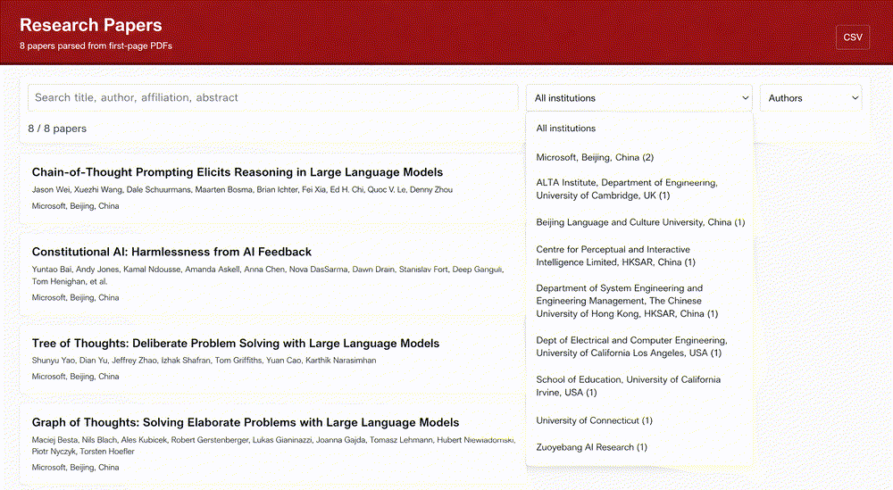

# Auto Paper List
*Parses every PDF and generate the webpage in one step.*

Auto Paper List turns a directory of research-paper PDFs into a searchable, static HTML page. It extracts each paper's title, authors,
affiliations, abstract, research problem, and proposed approach from the first
page, then embeds the results in a standalone webpage for convenient browsing.
 
Currently supports paper PDFs from **arXiv**, plus a subset of common
**conference and journal** PDF layouts.

 
The institution filter also provides a complete affiliation list with per-paper
counts, making it easy to browse a topic by research organization.



Put the PDF collection for any topic in `papers/`, run one command, and open
`web/papers.html` in a browser to explore it.

## Features

- Processes every PDF in a directory.
- Extracts metadata from the first page with `pypdf`.
- Produces CSV and XLSX intermediate data.
- Generates a self-contained static HTML page with no server or JavaScript
  dependencies.
- Searches across title, author, affiliation, and abstract text.
- Supports institution filtering, sorting, and highlighted matches.

 
## Quick start 

Requires Python 3.10 or newer.

```bash
pip install -r requirements.txt
```
 
Use your own papers:

```bash
python3 build_papers_webpage.py \
  --pdf-dir /path/to/papers \
  --title "My Research Papers"
```

The command automatically writes `data/papers_parsed.csv`,
`data/papers_parsed.xlsx`, and `web/papers.html`.

Then open `web/papers.html` in a browser.

PDF layouts vary widely, so extraction is heuristic. Review the CSV when using
a new paper collection and correct unusual title-page layouts when necessary.

## License

[MIT](LICENSE)
